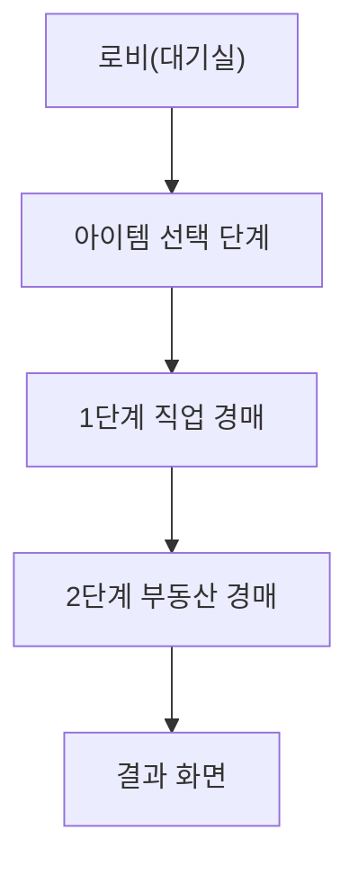

# JoopJoop 경매 게임 규칙 & 구현 가이드

이 문서는 우리 게임(온라인 For Sale 변형)의 **규칙 정의서 + 구현 가이드**입니다. 프론트/백엔드/디자인 팀 모두가 이 문서를 기준으로 구현해야 합니다.

---

## 1. 공통 개념 / 용어 정의

- **참가자(플레이어)**: 같은 방에서 게임을 진행하는 유저들.
- **돈(자금)**: 게임 내 화폐. **항상 1,000원 단위**로만 증감.
- **직업 카드(1단계 카드)**: 숫자 **1~30, 총 30장, 중복 없음**.
- **부동산 카드(2단계 카드)**: 숫자 **1~15, 각 숫자 2장, 총 30장**.
- **라운드**: 직업/부동산 카드가 참가자 수만큼 펼쳐지고, 참가자들이 베팅/카드 제출을 마치는 하나의 단위.
- **턴**: 한 라운드에서 **특정 참가자 1명이 행동하는 차례**.
- **방장**: 게임을 시작하는 유저. 방장이 `게임 시작`을 누르면 1단계가 시작됨.
- **아이템**: 1단계 시작 전 선택하는 능력. 게임 전체 동안 **각 유저당 1회 사용 가능**.

---

## 2. 게임 전체 플로우 요약

- **로비**
  - 방장이 인원을 모으고 `게임 시작` 클릭.
- **아이템 선택 단계 (프리 게임)**
  - 각 유저는 3개 아이템 중 1개 선택.
  - 선택 결과는 **다른 참가자에게도 공개**되어, 누가 어떤 아이템을 골랐는지 볼 수 있음.
- **1단계: 직업 카드 경매**
  - 모든 유저는 **초기 자금 15,000원**으로 시작.
  - 직업 카드 30장을 섞고, 참가자 수만큼 펼치는 라운드를 반복.
  - 남은 직업 카드 수 < 참가자 수가 되는 순간 1단계 종료.
- **2단계: 부동산 카드 경매**
  - 부동산 카드 30장(1~15 각 2장)을 섞고, 참가자 수만큼 펼치는 라운드를 반복.
  - 남은 부동산 카드 수 < 참가자 수가 되는 순간 2단계 종료.
- **결과 화면**
  - 각 참가자의 **부동산 총액 + 남은 돈**을 합산해 최종 순위 표시.

### 게임 플로우 다이어그램 (개략)

---

## 3. 1단계: 직업 카드 경매 규칙

### 3.1 초기 설정

- **초기 자금**: 모든 참가자에게 15,000원 지급.
- **직업 카드 덱**: 1~30번 카드 30장을 섞어서 덱으로 준비.
- **경매 순서**:
  - 게임 시작 시, 참가자들 사이에서 **랜덤으로 한 번만 정함**.
  - 정해진 순서는 **게임 내내 고정**되며, 1단계/2단계 모두 동일하게 사용 (단, 리버스 아이템에 의해 뒤집힐 수 있음).

### 3.2 라운드 흐름

- 각 라운드 시작 시:
  - 직업 카드 덱에서 **참가자 수만큼** 카드를 공개(펼침).
  - **카드 정렬 기준**: UI에서 카드를 **숫자 오름차순(1→30)** 으로 정렬해 보여줄 것을 권장.
  - **리롤 아이템 사용 가능 여부** 체크:
    - 1단계에서는 **해당 라운드의 첫 번째 턴 플레이어만** 라운드 시작 시점에 리롤 사용 가능.
- 이후 턴은 **현재 순서(또는 리버스 후 순서)** 에 따라 진행.

### 3.3 턴 내 행동 종류

각 참가자는 자신의 턴에 다음 행동 중 하나를 선택:

- **베팅**
  - 최소 베팅 단위: **1,000원**.
  - 현재 턴에서 **추가로 낼 금액**도 1,000원 단위.
  - 베팅 후:
    - 해당 금액만큼 **즉시 자금에서 차감**.
    - 현재 라운드에서 본인이 낸 총 베팅액을 UI에 표시.
    - 턴이 **다음 순서 참가자**에게 넘어감.
  - **베팅 금액 제한**: 보유 자금보다 많이 베팅할 수 없음.
- **포기(경매 포기)**
  - 포기 버튼을 누른 즉시:
    - 해당 참가자는 **이번 라운드에서 더 이상 베팅할 수 없음**.
    - 해당 참가자가 **지금까지 낸 금액의 절반을 환급**:
      - `환급액 = floor(누적 베팅 / 2, 1,000원 단위 내림)`
      - 예) 3,000원 베팅 후 포기 → 1,000원 환급.
    - 포기한 참가자는 해당 라운드가 끝날 때 **가장 낮은 직업 카드**를 가져감.
    - UI에서 **포기 상태**를 명확하게 표시 (예: 회색 처리, "포기" 뱃지 등).
- **자동 포기**
  - 남은 자금이 0원인 경우:
    - 더 이상 베팅할 수 없으므로, 해당 라운드에서 **자동으로 포기 상태**가 됨.
    - 이때도 라운드 종료 시 **가장 낮은 직업 카드**를 가져감.

### 3.4 턴 타이머 규칙

- 각 턴마다 **10초 제한 시간**.
- 제한 시간 안에 베팅/포기/아이템 사용 결정이 없으면:
  - 기본 동작: **자동 포기 처리**.
  - 자동 포기 시에도 **환급 규칙 동일** 적용 (지금까지 낸 금액의 절반 환급, 1,000원 단위 내림).

### 3.5 라운드 종료 규칙

- 한 라운드에서 **모든 참가자 중 1명만 남을 때까지** 턴을 반복.
  - 포기하지 않고 남은 1명은 **가장 높은 직업 카드**를 가져감.
  - 그 외 포기한 참가자들은 **포기한 순서의 역순**으로 낮은 카드부터 가져가는 For Sale 룰 변형을 명시적으로 정할 필요가 있음.
    - 제안 규칙(기본안):
      - **가장 먼저 포기한 사람**이 **가장 낮은 카드**를 가져감.
      - 두 번째로 포기한 사람은 그다음 낮은 카드 …
      - 마지막까지 남아 베팅을 유지한 사람은 **가장 높은 카드**.
- 한 라운드 종료 후:
  - 각 참가자는 획득한 직업 카드를 **개인 카드 목록**에 추가 (본인만 볼 수 있음).
  - 사용된 직업 카드는 덱에서 제거.

### 3.6 1단계 종료 조건

- 직업 카드 덱에서 **남은 카드 수 < 참가자 수** 가 되는 순간 1단계 종료.
  - 예) 참가자 4명 → 7라운드 진행 후 2장 남으면 버림.
- 남은 카드는 **버려진 카드**로 처리하고 게임에 사용하지 않음.

---

## 4. 2단계: 부동산 카드 경매 규칙

### 4.1 초기 설정

- **부동산 카드 덱**: 1~15 각 숫자 2장, 총 30장을 섞어 덱으로 준비.
- **경매 순서**: 1단계에서 사용한 순서를 **그대로 유지** (리버스 아이템에 의해 변경되었으면 뒤집힌 순서 사용).
- **각 참가자의 직업 카드**: 1단계에서 획득한 직업 카드들. 이제 이 카드들을 사용해 부동산 카드를 가져가게 됨.

### 4.2 라운드 흐름

- 각 부동산 라운드 시작 시:
  - 부동산 덱에서 **참가자 수만큼** 카드를 공개.
  - UI에서 **숫자 오름차순(1→15)** 으로 정렬해 보여주는 것을 권장.
  - 2단계에서는 **라운드 시작 시점에 누구나 리롤 아이템 사용 가능** (아이템을 아직 사용하지 않았다면).

### 4.3 카드 제출 규칙

- 각 라운드에서 모든 참가자는 **자신의 직업 카드 중 1장**을 선택해 비공개로 제출.
- 제출 제한 시간: 전 참가자 공통으로 **일정 시간(예: 10초)**.
- 제한 시간 동작:
  - 제한 시간 내에 카드를 선택하지 못한 참가자는
    - 보유 중인 직업 카드 중 **가장 낮은 숫자 카드**가 자동으로 제출됨.

### 4.4 카드 공개 및 부동산 카드 배분

- 모든 참가자가 직업 카드를 제출하면 **동시에 오픈**.
- 직업 카드 숫자 기준으로 **내림차순(큰 숫자 → 작은 숫자)** 정렬.
- 부동산 카드 정렬 기준: **오름차순(낮은 가격 → 높은 가격)** 으로 테이블에 놓였다고 가정.
- 배분 규칙:
  - **가장 높은 직업 카드를 낸 사람**이 **가장 높은 부동산 카드**를 가져감.
  - 두 번째로 높은 직업 카드를 낸 사람은 그 다음 높은 부동산 카드 … 반복.
  - 동점(같은 숫자의 직업 카드) 처리 방식은 명시 필요:
    - 제안 규칙(기본안): 동점 시 **1단계에서의 경매 순서(현재 턴 순서)** 를 기준으로 앞선 사람이 더 높은 부동산 카드를 가져감.
- 사용된 직업 카드는 **버려진 카드**로 처리 (2단계에서 재사용하지 않음).

### 4.5 2단계 종료 조건

- 부동산 카드 덱에서 **남은 카드 수 < 참가자 수** 가 되는 순간 2단계 종료.
- 남은 카드는 버려진 카드로 처리.

---

## 5. 아이템 시스템 규칙

### 5.1 공통 규칙

- 1단계 시작 **이전**에 각 유저는 **3개의 아이템 중 1개 선택**.
- 선택한 아이템은 **게임 전체(1~2단계)** 동안 **각 유저당 1회만 사용 가능**.
- **상대 아이템 공개**: 누가 어떤 아이템을 선택했는지는 **모든 유저가 볼 수 있음**.
- 아이템 사용은 **본인의 턴에만 가능** (규칙에서 별도 명시된 경우 제외).

### 5.2 리롤 (카드 리롤 아이템)

- **효과**: 현재 라운드에 펼쳐진 카드들을 **모두 다시 덱으로 섞고**, 같은 수의 카드를 새로 펼침.
- **1단계에서의 사용 조건**:
  - 각 라운드가 시작될 때, **해당 라운드의 첫 번째 턴 플레이어만** 사용 가능.
  - 라운드 시작 직후, 아직 아무도 베팅/포기하지 않은 상태에서만 사용.
- **2단계에서의 사용 조건**:
  - 각 라운드가 시작될 때, **누구나 자신의 턴에** 사용 가능 (아직 사용 이력이 없다면).
  - 이미 직업 카드를 제출한 뒤에는 사용 불가 (제출 전 단계에서만 허용할지 여부는 최종 정의 필요하나, 기본안은 "제출 전"에만 허용).

### 5.3 엿보기 (상대 정보 확인 아이템)

- **공통 룰**:
  - 본인 턴에만 사용 가능.
  - 타겟을 1명 선택해야 함.
- **1단계에서의 효과**:
  - 선택한 상대의 **남은 돈**을 확인.
  - 확인은 **일회성**: 현재 시점의 금액만 볼 수 있고, 지속적인 실시간 갱신은 제공하지 않음.
- **2단계에서의 효과**:
  - 선택한 상대가 **보유한 부동산 카드 목록**을 확인.
  - 역시 일회성으로, 확인 시점에서의 상태만 보여줌.

### 5.4 리버스 (순서 반대로 만들기)

- **효과**: 현재까지 사용하던 **턴 순서 전체를 반대로 뒤집고**, 그 이후 게임 내내(1단계 & 2단계 모두) 그 순서를 유지.
- **사용 가능 단계**: **1단계 직업 경매 단계에서만** 사용 가능.
- **사용 타이밍**:
  - 본인 턴에만 사용 가능.
  - 이 아이템을 사용한 턴에는 **반드시 베팅을 해야 하며, 포기할 수 없음**.
- **라운드당 사용 제한**:
  - 한 라운드에서 **리버스 아이템은 단 1회만 발동 가능**.
  - 한 플레이어가 리버스를 먼저 사용하면, 그 라운드에서는 다른 플레이어는 리버스를 사용할 수 없음.
- **지속 시간**:
  - 한 번 순서가 바뀌면 **게임 종료까지(2단계 포함) 계속 유지**.

---

## 6. 화면/UX 요구사항 (프론트 기준)

### 6.0 화면·디바이스 기준

- **개발 기준 기기**: **iPhone 13 mini**
- 화면 배치 및 요소 크기는 **iPhone 13 mini** 화면에서 볼 때 **매끄럽게** 보이도록 개발한다.
- 참고: iPhone 13 mini 뷰포트(포트레이트) — **375 × 812 pt**. CSS·레이아웃 검증 시 이 크기를 기준으로 한다.
- 더 큰 기기에서의 동작도 고려하되, 우선 목표는 375pt 너비에서 스크롤·겹침·잘림 없이 자연스럽게 보이는 것이다.

### 6.1 1단계 화면 요소 (요구사항 그대로 반영)

- **경매 라운드 정보**: 현재 라운드 번호, 전체 가능 라운드 수 표기.
- **턴 타이머**: "남은 시간 10초" 형태로 UI에 표시, 0초 시 자동 포기 처리.
- **참가자 목록 영역**:
  - 프로필 사진, 닉네임.
  - 각 참가자의 **현재 라운드 베팅 금액**.
  - **포기 여부 표시** (포기 시 아이콘/텍스트/회색 처리 등).
  - **베팅 순서** (고정된 턴 순서를 시각적으로 표시).
  - **현재 턴인 사람 강조 표시** (테두리/하이라이트 등).
- **카드 영역**:
  - 펼쳐진 직업 카드 목록 (참가자 수만큼).
  - 아직 펼쳐지지 않은 직업 카드 뭉치(덱, 뒷면으로 표시).
- **내 정보 영역**:
  - 내 프로필 사진, 닉네임.
  - 내가 가진 **남은 돈**.
  - 내가 획득한 **직업 카드 목록** (본인만 볼 수 있게).
- **조작 영역**:
  - `베팅하기` 버튼 (1,000원 단위 증감 컨트롤 포함).
  - `베팅 포기` 버튼.
  - `아이템 사용` 버튼(아이콘) 및 사용 가능/사용 완료 상태 표시.

### 6.2 2단계 화면 요소

- **참가자 정보 영역**:
  - 각 참가자의 프로필, 이름.
  - 각 참가자가 이번 라운드에 제출한 카드 여부(제출 전/후 상태만, 카드 내용은 오픈 전까지 비공개).
- **제출 타이머**: 남은 선택 시간 표시.
- **라운드 정보 텍스트**: 현재 부동산 라운드 번호.
- **카드 영역**:
  - 참가자 수에 맞게 펼쳐진 부동산 카드들.
  - 아직 펼쳐지지 않은 부동산 카드 뭉치(덱).
- **내 정보 영역**:
  - 내 프로필.
  - 내 남은 돈.
  - 내가 가진 **직업 카드들** (선택 가능 형태로 표시).
  - 내가 획득한 **부동산 카드 목록**.
- **아이템 사용 버튼**: 엿보기/리롤 사용 가능 상태, 사용 후 비활성화.

### 6.3 결과 화면 요소

- 각 참가자의:
  - 닉네임, 프로필.
  - 획득한 부동산 카드 목록 및 총합.
  - 남은 돈.
  - **최종 점수 = 부동산 총액 + 남은 돈**.
  - 순위(1등, 2등, …) 표시.

---

## 7. 상태/로직 설계 가이드 (요약)

- **게임 상태 머신 및 이벤트 상세**: [STATE_MACHINE.md](./STATE_MACHINE.md) 참고.
- **게임 상태 머신(예시)**:
  - `Lobby` → `ItemSelection` → `Phase1_JobAuction` → `Phase2_EstateAuction` → `Result`.
- **중요 상태 값**:
  - `players`: id, 닉네임, 프로필, 아이템 종류, 사용 여부, 남은 돈, 소지 직업 카드, 소지 부동산 카드.
  - `turnOrder`: 현재 적용되는 턴 순서 배열.
  - `currentPhase`: 1 or 2.
  - `currentRound`: 라운드 번호.
  - `jobDeck`, `estateDeck`: 남은 카드 리스트.
  - `roundState`: 현재 라운드에서의 베팅/제출 상태.
- **타이머 처리**:
  - 서버 기준 시간으로 관리하고, 프론트는 표시만.
  - 타이머 만료 시 서버에서 **자동 포기/자동 카드 선택** 처리.

---

## 8. 추후 확장/명시가 필요한 부분 (기본안 포함)

- **동점 처리**: 위에서 기본안을 제시(턴 순서 우선)했으며, 다른 정책을 채택할 경우 이 문서를 수정해 전 팀에 공지.
- **네트워크/재접속 처리**: 이 문서에서는 범위를 벗어나므로 별도 기술 문서에서 정의.
- **애니메이션/연출**: 디자인 팀과 협의해 별도 UI/UX 가이드에 명시.

이 문서는 팀 전체가 공유하는 **단일 진실 소스(Single Source of Truth)** 로 사용하며, 실제 구현이 이 규칙에 맞는지 항상 검증해야 합니다.
