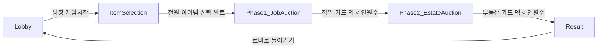
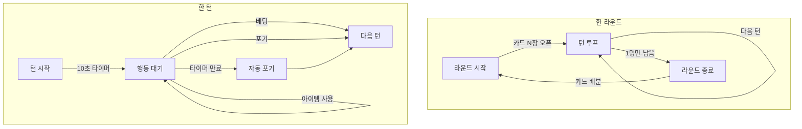
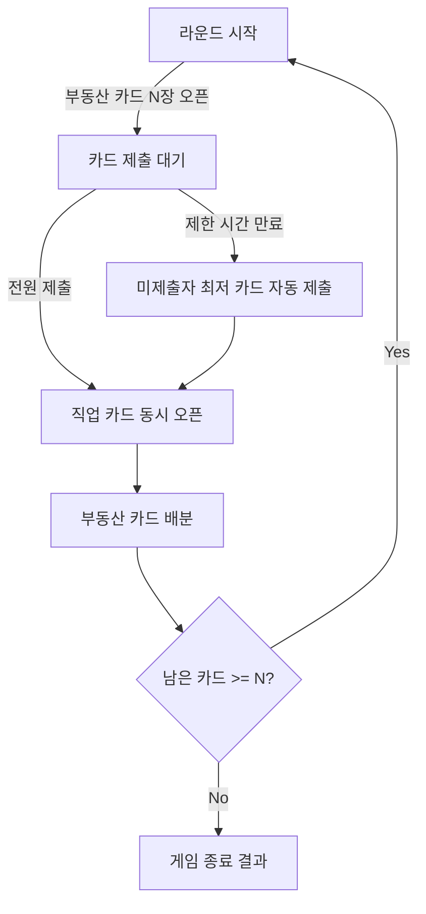
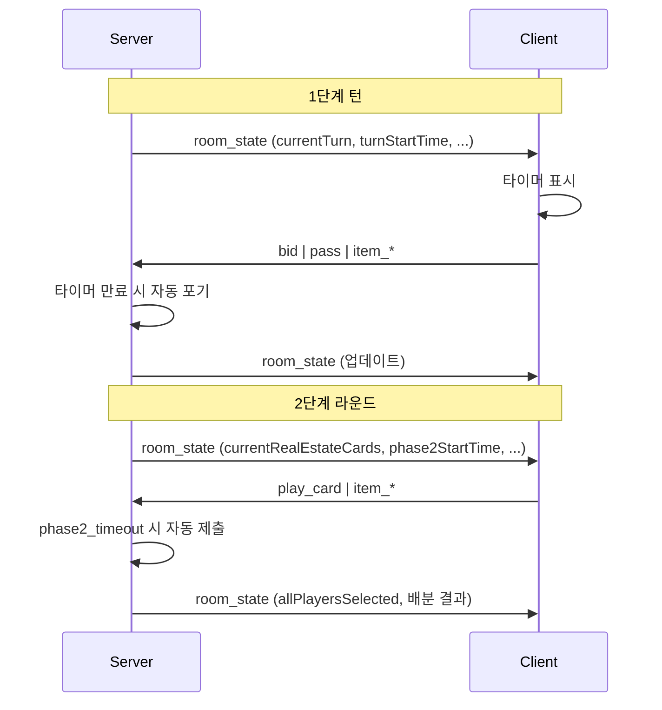

# 게임 상태 머신 및 이벤트 정의

서버와 클라이언트가 공통으로 사용하는 게임 단계·라운드·턴 구조와, 주요 이벤트를 정의합니다. 규칙 상세는 [GAME_RULES.md](./GAME_RULES.md)를 참고하세요.

---

## 1. 게임 단계(Phase) 상태 머신

전체 게임은 아래 단계를 순서대로 거칩니다.

| 상태 | 설명 | 서버 `phase` / `gameState` |
|------|------|----------------------------|
| **Lobby** | 대기실. 인원 모집, 방장이 게임 시작 가능 | `phase: 'lobby'` |
| **ItemSelection** | 1단계 전, 각자 아이템 1개 선택. 선택 결과 공개 | `phase: 'item_selection'` |
| **Phase1_JobAuction** | 직업 카드 경매. 라운드·턴 진행 | `phase: 'phase1_bidding'`, `gameState: 'playing'` |
| **Phase2_EstateAuction** | 부동산 카드 경매. 라운드별 카드 제출 | `phase: 'phase2_playing'`, `gameState: 'playing'` |
| **Result** | 최종 순위 표시 | `phase: 'game_over'` |

---

## 2. 1단계(직업 경매) 라운드·턴 구조

1단계는 **라운드** 단위로 돌아가고, 한 라운드 안에서는 **턴**이 순서대로 진행됩니다.

### 2.1 1단계 상태 값 (서버/클라이언트 공유)

| 필드 | 설명 |
|------|------|
| `roundNumber` | 현재 직업 경매 라운드 번호 |
| `currentTurn` | 현재 턴인 플레이어 ID |
| `turnOrder` | 턴 순서 배열 (리버스 시 반대 순서 유지) |
| `turnStartTime` | 현재 턴 시작 시각 (Unix sec). 타이머 계산용 |
| `turnTimeout` | 턴 제한 시간 (초, 예: 10) |
| `currentProperties` | 이번 라운드에 펼쳐진 직업 카드 ID 목록 |
| `currentBid` | 현재 라운드 누적 최고 베팅액 |
| `mustBidPlayer` | 리버스 사용 턴인 경우, 해당 플레이어는 포기 불가 |
| `reverseUsedThisRound` | 이번 라운드에 리버스 사용 여부 (라운드당 1회) |

### 2.2 1단계 이벤트

| 이벤트 | 방향 | 설명 |
|--------|------|------|
| `round_start` | 서버 → 클라이언트 | 새 라운드 시작, 카드 N장 오픈, 첫 턴 설정 |
| `turn_start` | 서버 → 클라이언트 | 턴 시작, `turnStartTime` 갱신 |
| `bid` | 클라이언트 → 서버 | 베팅 금액 제출 (1,000원 단위) |
| `pass` | 클라이언트 → 서버 | 경매 포기 (환급 규칙 적용) |
| `item_reroll` | 클라이언트 → 서버 | 리롤 사용 (1단계: 첫 턴만) |
| `item_peek` | 클라이언트 → 서버 | 엿보기 사용 + 대상 플레이어 ID |
| `item_reverse` | 클라이언트 → 서버 | 리버스 사용 (해당 턴 필수 베팅) |
| `turn_timeout` | 서버 내부 | 10초 만료 시 자동 포기 처리 후 다음 턴 |
| `round_end` | 서버 → 클라이언트 | 라운드 종료, 카드 배분 결과 전달 |

---

## 3. 2단계(부동산 경매) 라운드 구조

2단계는 **라운드** 단위로, 모든 참가자가 동시에 직업 카드 1장을 제출한 뒤 한 번에 오픈합니다.

### 3.1 2단계 상태 값

| 필드 | 설명 |
|------|------|
| `phase2RoundNumber` | 현재 부동산 라운드 번호 |
| `currentRealEstateCards` | 이번 라운드에 펼쳐진 부동산 카드 ID 목록 |
| `phase2StartTime` | 이번 라운드 제출 시작 시각 |
| `phase2Timeout` | 제출 제한 시간 (초) |
| `allPlayersSelected` | 전원 제출 완료 여부 |
| `hasSelected` (per player) | 해당 플레이어 제출 여부 |
| `selectedProperty` (per player) | 제출한 직업 카드 ID (오픈 전까지 비공개) |

### 3.2 2단계 이벤트

| 이벤트 | 방향 | 설명 |
|--------|------|------|
| `phase2_round_start` | 서버 → 클라이언트 | 부동산 카드 N장 오픈, 제출 타이머 시작 |
| `play_card` | 클라이언트 → 서버 | 제출할 직업 카드 ID |
| `item_reroll` | 클라이언트 → 서버 | 리롤 사용 (2단계: 라운드 시작 후 제출 전) |
| `item_peek` | 클라이언트 → 서버 | 엿보기 사용 + 대상 (상대 부동산 카드 확인) |
| `phase2_timeout` | 서버 내부 | 제한 시간 만료 시 미제출자 최저 카드 자동 제출 |
| `phase2_reveal` | 서버 → 클라이언트 | 전원 제출 완료, 직업 카드 오픈 및 부동산 배분 결과 |
| `phase2_round_end` | 서버 → 클라이언트 | 라운드 정리, 다음 라운드 또는 게임 종료 |

---

## 4. 타이머 만료 처리 (서버 권한)

- **1단계 턴 타이머**: 만료 시 해당 턴 플레이어를 **자동 포기** 처리 (환급 규칙 동일), 다음 턴으로 진행.
- **2단계 제출 타이머**: 만료 시 미제출자는 **가장 낮은 직업 카드** 자동 제출 후, 전원 제출된 것으로 간주하고 오픈·배분 진행.

클라이언트는 `turnStartTime` / `phase2StartTime`과 `turnTimeout` / `phase2Timeout`으로 남은 시간만 표시하고, 실제 만료 동작은 서버에서만 수행하는 것을 권장합니다.

---

## 5. 상태 동기화 흐름 요약

---

## 6. 타입 정의 참고 (프론트엔드)

게임 상태 타입은 `JoopJoop_front/src/lib/socket-types.ts`의 `GamePhase`, `GameState`, `Player` 등을 참고하고, 서버와 필드 이름·의미를 맞추어 사용하세요. 상태 머신 전이 시 위 이벤트와 `room_state`(또는 동일 역할의 브로드캐스트)로 전체 상태를 내려주면 클라이언트는 그대로 렌더링하면 됩니다.

이 문서는 [GAME_RULES.md](./GAME_RULES.md) §7 상태/로직 설계 가이드와 대응됩니다. 규칙 변경 시 두 문서를 함께 갱신하세요.
